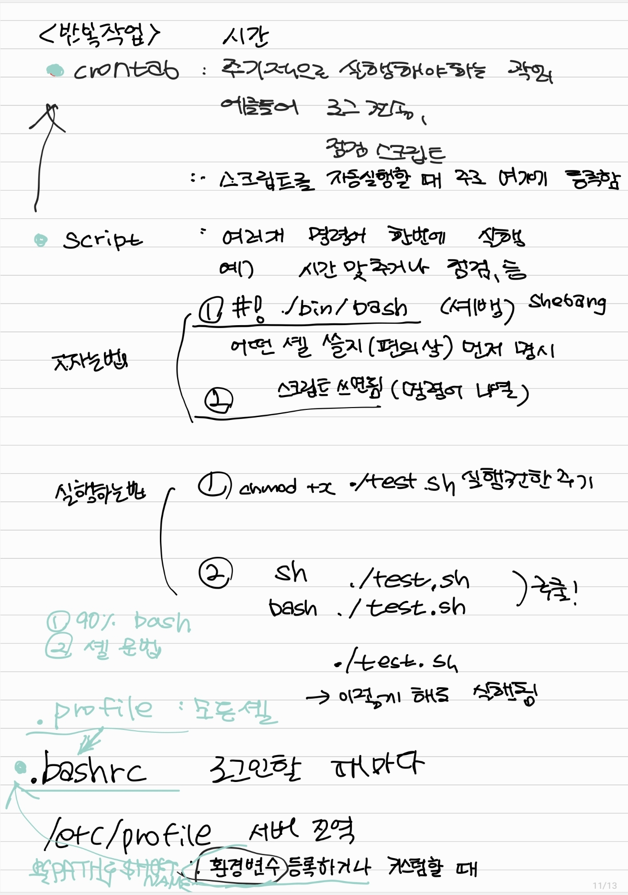

#J
#dsiajfoi

# 25.1.5 공부!!

# VM 우분투 시

새로운 우분투를 들어가면 먼저 로그인을 한 후

- sudo su 를 입력해서 루트로 로그인을 한다
- history에 시간 추가
- ssh 접근 설정, ssh 자동 연결끊김 해제
- 시간대 설정
- crontab에 주기적 실행 등록

# 사용법 참고

- vi 들어가서 검색: insert 버전에서 Esc 누른 상태에서 /찾고싶은거 엔터

# 1.5 강의 핵심

## 질문

chmod +r 읽기권한 부여

chmod +w

chmod +x /root/admin/rdate.sh    이거 뭐임? → 스크립트 실행 권한

drwxrwxrwx / _rwxrwxrwx

u g o

첫번째 세개 : user 소유자 권한

두번째 세개 : group 소유그룹 권한

세번째 세개  : other 모든사용자

rwx______ 

rwxr__r__

___ ___ ___

111 111 111 = rwxrwxrwx = 777

640

rw_r_____

chmod 777
